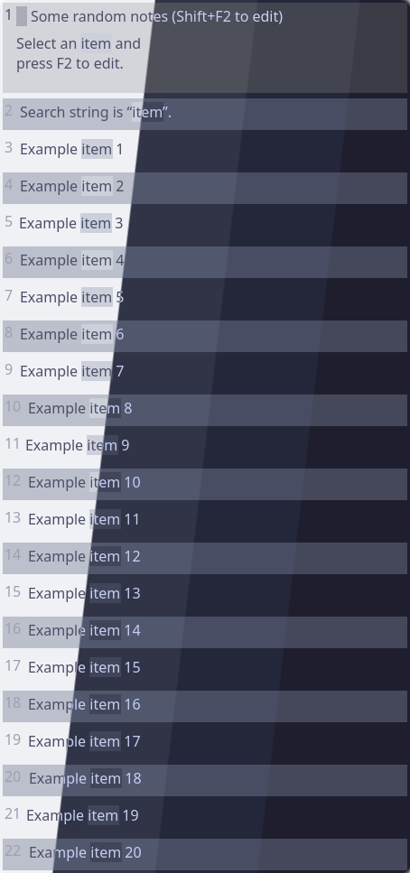
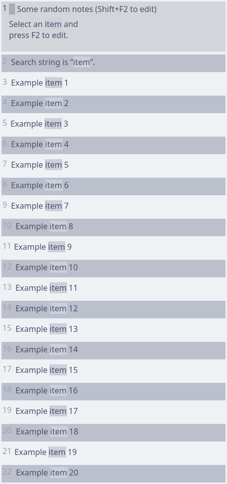
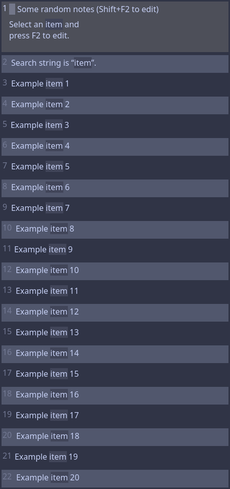
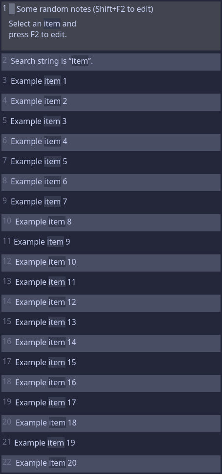
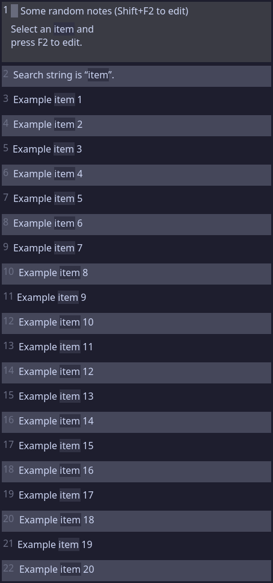

<h3 align="center">
	 
	
	Catppuccin for <a href="https://github.com/hluk/CopyQ">CopyQ</a>
	
</h3>

	
	
	

	

## Previews

🌻 Latte

🪴 Frappé

🌺 Macchiato

🌿 Mocha

## Usage

> [!NOTE]
> It is recommended to enable **Set colors for tabs, toolbar and menus** in **File** > **Preferences** > **Appearance** for the best experience.
> You will have to re-enable this option every time you switch themes.

### Recommended: Switchable Installation

1. Download the flavor(s) of your choice from [themes](themes/).
2. Copy the file into the CopyQ themes directory (Windows: `%APPDATA%\copyq\themes\`, Linux: `~/.config/copyq/themes/`, macOS: `~/Library/Application Support/copyq/themes/`).
3. Open the app and go to **File** > **Preferences** > **Appearance**.
4. Select your flavor of choice from the theme dropdown and select apply.

### Alternative: One-Time Installation

1. Download the flavor of your choice from [themes](themes/).
2. Open the app and go to **File** > **Preferences** > **Appearance** > **Load Theme**.
3. Select the downloaded flavor file and select apply.

## 💝 Thanks to

- [Scarce Koi](https://github.com/scarcekoi)

&nbsp;

	

	Copyright &copy; 2021-present <a href="https://github.com/catppuccin" target="_blank">Catppuccin Org</a>

	

